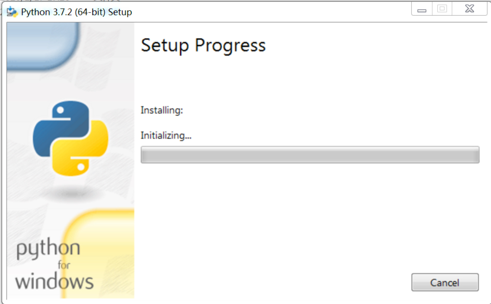
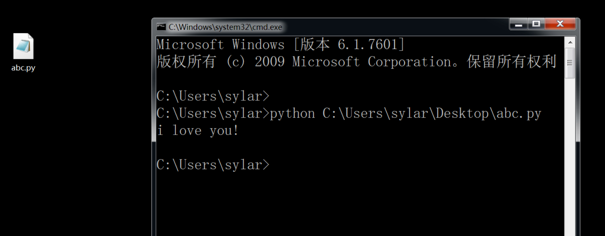
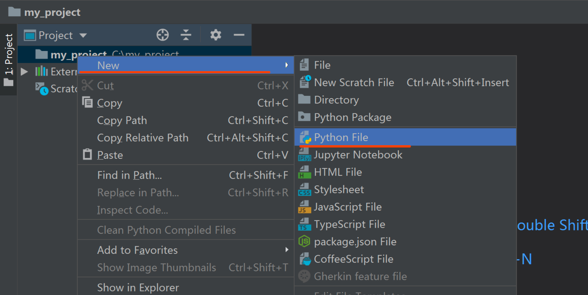

# Bilibili-Python-QiaoFu-01

# 一.Python介绍

 

 

Python的创始人为吉多·范罗苏姆（Guido van Rossum）。1989年的圣诞节期间，吉多·范罗苏姆为了在阿姆斯特丹打发时间，决心开发一个新的脚本解释程序，作为ABC语言的一种继承。 

最新的TIOBE排行榜，Python已经占据世界第三名的位置， Python崇尚优美、简单、清晰，是一个优秀并广泛使用的语言。


 


 


 

由上图可见，Python整体呈上升趋势，反映出Python应用越来越广泛并且也逐渐得到业内的认可！！！

 

Python可以应用于众多领域，如：数据分析、组件集成、网络服务、图像处理、数值计算和科学计算等众多领域。目前业内几乎所有大中型互联网企业都在使用Python，如：Youtube、Dropbox、BT、Quora（中国知乎）、豆瓣、知乎、Google、Yahoo!、Facebook、NASA、百度、腾讯、汽车之家、美团等。

 

**目前Python主要应用领域：**

l WEB开发——最火的Python web框架Django是全球第5大web框架, 支持异步高并发的Tornado框架，短小精悍的flask,bottle, Django官方的标语把Django定义为the framework for perfectionist with deadlines(大意是一个为完全主义者开发的高效率web框架)，越来越多的人用Python写web程序，而不是php

l 网络编程——支持高并发的Twisted网络框架， py3引入的asyncio使其异步高并发编程能力更加强悍

l 爬虫——爬虫领域，Python几乎是霸主地位，全球大部分的爬虫都是用python程序写的，Scrapy\Request\BeautifuSoap\urllib等爬虫库，使你想爬啥就爬啥

l 云计算——知名的云计算框架OpenStack基于Python开发

l 人工智能、数据分析—— Python 是目前公认的人工智能和数据分析领域的必备语言，大量机器学习框架如PyTouch,OpenCV,sklearn等都是用Python开发的

l 自动化运维——问问中国的每个运维人员，运维人员必须会的语言是什么？10个人相信会给你一个相同的答案，就是Python

l 金融分析——我个人之前在金融行业，早在2010年的时候，我们公司写的好多分析程序、高频交易软件就是用的Python,到目前,Python是金融分析、量化交易领域里用的最多的语言

l 科学运算—— 97年开始，NASA就在大量使用Python在进行各种复杂的科学运算，随着NumPy, SciPy, Matplotlib, Enthought librarys等众多程序库的开发，使的Python越来越适合于做科学计算、绘制高质量的2D和3D图像。

l 游戏开发——在网络游戏开发中Python也有很多应用。相比Lua or C++,Python 比 Lua 有更高阶的抽象能力，可以用更少的代码描述游戏业务逻辑，与 Lua 相比，Python 更适合作为一种 Host 语言，即程序的入口点是在 Python 那一端会比较好，然后用 C/C++ 在非常必要的时候写一些扩展。Python 非常适合编写 1 万行以上的项目，而且能够很好地把网游项目的规模控制在 10 万行代码以内。另外据我所知，知名的游戏<文明> 就是用Python写的

l 少儿编程——最近两年火起来的少儿编程，均把Python当做一门重要课程

 

## 1.1.编程语言的分类

 

编程语言主要分为编译型和解释型编程语言

编译型和解释型的区别是什么?

编译型语言会通过编译器把程序代码编译(翻译)成机器所能识别的二进制代码. 其特点呢, 就是一次性把源代码翻译成一个二进制文件. 拿着二进制文件去找操作系统去执行. 由于执行的是计算机熟悉的二级制代码, 执行效率就会高很多. 相对应的还有一种是解释型语言. 这类语言一般脱离了操作系统的束缚. 直接把代码执行在解释器上. 由解释器负责逐行的解释代码. 把每行代码翻译成机器识别的二进制指令. 再由操作系统去执行. 这样做的好处呢. 代码直接面对的是解释器. 就摆脱了不同操作系统底层的差异. 实现跨平台效果. 

 

 


 


**编译型vs解释型**

**编译型**

优点：执行效率高

缺点：不同平台移植起来会有些麻烦

 

**解释型**

优点：一般都会有很好的跨平台性

缺点：性能相对编译型要差一点

 

## 1.2.Python的优缺点和Python解释器

 

首先, Python是一门解释型编程语言. Python的代码是执行在Python解释器上的. 

 

当我们编写Python代码时，我们得到的是一个包含Python代码的以.py为扩展名的文本文件。要运行代码，就需要Python解释器去执行.py文件。

由于整个Python语言从规范到解释器都是开源的，所以理论上，只要水平够高，任何人都可以编写Python解释器来执行Python代码（当然难度很大）。事实上，确实存在多种Python解释器。

 

**CPython**

  当我们从[Python官方网站](https://www.python.org/)下载并安装好Python后，我们就直接获得了一个官方版本的解释器：CPython。这个解释器是用C语言开发的，所以叫CPython。在命令行下运行python就是启动CPython解释器。

CPython是使用最广的Python解释器。我们所有代码也都在CPython下执行。

 

**IPython**

  IPython是基于CPython之上的一个交互式解释器，也就是说，IPython只是在交互方式上有所增强，但是执行Python代码的功能和CPython是完全一样的。好比很多国产浏览器虽然外观不同，但内核其实都是调用了IE。

 

**PyPy**

  PyPy是另一个Python解释器，它的目标是执行速度。PyPy采用[JIT技术](http://en.wikipedia.org/wiki/Just-in-time_compilation)，对Python代码进行动态编译（注意不是解释），所以可以显著提高Python代码的执行速度。

绝大部分Python代码都可以在PyPy下运行，但是PyPy和CPython有一些是不同的，这就导致相同的Python代码在两种解释器下执行可能会有不同的结果。如果你的代码要放到PyPy下执行，就需要了解[PyPy和CPython的不同点](http://pypy.readthedocs.org/en/latest/cpython_differences.html)。

 

**Jython**

  Jython是运行在Java平台上的Python解释器，可以直接把Python代码编译成Java字节码执行。

 

**IronPython**

  IronPython和Jython类似，只不过IronPython是运行在微软.Net平台上的Python解释器，可以直接把Python代码编译成.Net的字节码。

 

 

先看优点

\1.   Python的定位是**“优雅”、“明确”、“简单”**，所以Python程序看上去总是简单易懂，初学者学Python，不但入门容易，而且将来深入下去，可以编写那些非常非常复杂的程序。

\2.   开发效率非常高，Python有非常强大的第三方库，基本上你想通过计算机实现任何功能，Python官方库里都有相应的模块进行支持，直接下载调用后，在基础库的基础上再进行开发，大大降低开发周期，避免重复造轮子。

\3.   高级语言————当你用Python语言编写程序的时候，你无需考虑诸如如何管理你的程序使用的内存一类的底层细节

\4.   可移植性————由于它的开源本质，Python已经被移植在许多平台上（经过改动使它能够工 作在不同平台上）。如果你小心地避免使用依赖于系统的特性，那么你的所有Python程序无需修改就几乎可以在市场上所有的系统平台上运行

\5.   可扩展性————如果你需要你的一段关键代码运行得更快或者希望某些算法不公开，你可以把你的部分程序用C或C++编写，然后在你的Python程序中使用它们。

\6.   可嵌入性————你可以把Python嵌入你的C/C++程序，从而向你的程序用户提供脚本功能。

再看缺点：

\1.   速度慢，Python 的运行速度相比C语言确实慢很多，跟JAVA相比也要慢一些，因此这也是很多所谓的大牛不屑于使用Python的主要原因，但其实这里所指的运行速度慢在大多数情况下用户是无法直接感知到的，必须借助测试工具才能体现出来，比如你用C运一个程序花了0.01s,用Python是0.1s,这样C语言直接比Python快了10倍,算是非常夸张了，但是你是无法直接通过肉眼感知的，因为一个正常人所能感知的时间最小单位是0.15-0.4s左右，哈哈。其实在大多数情况下Python已经完全可以满足你对程序速度的要求，除非你要写对速度要求极高的搜索引擎等，这种情况下，当然还是建议你用C去实现的。

\2.   代码不能加密，因为PYTHON是解释性语言，它的源码都是以名文形式存放的，不过我不认为这算是一个缺点，如果你的项目要求源代码必须是加密的，那你一开始就不应该用Python来去实现。

\3.   线程不能利用多CPU问题，这是Python被人诟病最多的一个缺点，GIL即全局解释器锁（Global Interpreter Lock），是[计算机程序设计语言](http://zh.wikipedia.org/wiki/计算机程序设计语言)[解释器](http://zh.wikipedia.org/wiki/解释器)用于[同步](http://zh.wikipedia.org/wiki/同步)[线程](http://zh.wikipedia.org/wiki/线程)的工具，使得任何时刻仅有一个线程在执行，Python的线程是操作系统的原生线程。在Linux上为pthread，在Windows上为Win thread，完全由操作系统调度线程的执行。一个python解释器进程内有一条主线程，以及多条用户程序的执行线程。即使在多核CPU平台上，由于GIL的存在，所以禁止多线程的并行执行。关于这个问题的折衷解决方法，我们在以后线程和进程章节里再进行详细探讨。

 

 

  当然，Python还有一些其它的小缺点，在这就不一一列举了，我想说的是，**任何一门语言都不是完美的**，都有擅长和不擅长做的事情，建议各位不要拿一个语言的劣势去跟另一个语言的优势来去比较，语言只是一个工具，是实现程序设计师思想的工具，就像我们之前中学学几何时，有的时候需要要圆规，有的时候需要用三角尺一样，拿相应的工具去做它最擅长的事才是正确的选择。之前很多人问我Shell和Python到底哪个好？我回答说Shell是个脚本语言，但Python不只是个脚本语言，能做的事情更多，然后又有钻牛角尖的人说完全没必要学Python, Python能做的事情Shell都可以做，只要你足够牛B,然后又举了用Shell可以写俄罗斯方块这样的游戏，对此我能说表达只能是，不要跟SB理论，SB会把你拉到跟他一样的高度，然后用充分的经验把你打倒。

 

 

 

# 二. python发展史

 

l 1989年，为了打发圣诞节假期，Guido(龟叔)开始写Python语言的解释器。Python这个名字，来自Guido所挚爱的电视剧Monty Python’s Flying Circus。他希望这个新的叫做Python的语言，能符合他的理想：创造一种C和shell之间，功能全面，易学易用，可拓展的语言。

l 1991年，第一个Python解释器诞生。它是用C语言实现的，并能够调用C语言的库文件。从一出生，Python已经具有了：类，函数，异常处理，包含表和词典在内的核心数据类型，以及模块为基础的拓展系统。

l Granddaddy of Python web frameworks, Zope 1 was released in 1999

l Python 1.0 - January 1994 增加了 [lambda](https://en.wikipedia.org/wiki/Lambda_calculus), [map](https://en.wikipedia.org/wiki/Map_(higher-order_function)), [filter](https://en.wikipedia.org/wiki/Filter_(higher-order_function)) and [reduce](https://en.wikipedia.org/wiki/Fold_(higher-order_function)).

l Python 2.0 - October 16, 2000，加入了内存回收机制，构成了现在Python语言框架的基础

l Python 2.4 - November 30, 2004, 同年目前最流行的WEB框架Django 诞生

l Python 2.5 - September 19, 2006

l Python 2.6 - October 1, 2008

l Python 2.7 - July 3, 2010

l In November 2014, it was announced that Python 2.7 would be supported until 2020, and reaffirmed that there would be no 2.8 release as users were expected to move to Python 3.4+ as soon as possible

l Python 3.0 - December 3, 2008

l Python 3.1 - June 27, 2009

l Python 3.2 - February 20, 2011

l Python 3.3 - September 29, 2012

l Python 3.4 - March 16, 2014

l Python 3.5 - September 13, 2015

l Python 3.6 - December-23, 2016发布

l Python 3.7 - June-27, 2018发布

l Python 3.8.1 - December-18, 2019发布

 

 

 

# 三.Python的安装

\1. 下载合适的版本

https://www.python.org/downloads/windows/


 


 

\2. 安装过程. 

不论是windows还是mac. 都使用安装包来安装. 安装过程基本一致

注意: 先打钩, 然后选customize, 此处的勾选可以自动帮我们完成环境变量的配置. 可以避免非常多的麻烦事儿


 


 


 



 


 

安装结束. 测试安装是否成功. 键盘输入win+r


 

输入cmd回车. 打开cmd窗口, 在cmd中输入python, 如果有以下效果. 证明Python安装没有问题了. 可以写代码了. 


 

 

 

# 四. 第一个Python程序

 

python程序有两种编写方式:

\1.    进入cmd控制台. 输入Python进入命令行模式. 这时候我们可以直接编写Python程序


 

 

\2.   也可以在.py文件中编写Python代码. 通过Python命令来执行Python代码

注意, 这里很多零基础小伙伴要注意了. 在Windows中默认我们是看不到文件的后缀名的. 这里作为一名正经程序员. 必须要把文件的后缀名显示出来. 否则在编程的时候就容易把文件名搞错了. 

这里随便找个文件夹. 然后按一下键盘上的alt. 选择工具-> 文件夹选项.


在文件夹选项里. 点击"查看", 往下拉. 找到"隐藏已知文件类型的扩展名". 去掉钩. "确定"即可. 


然后咱们就可以安心的写代码了, 在桌面新建一个文本文档. 然后重命名该文档为"xxx.py".  Python程序要写在.py文件中. 


   再然后, 我们依然打开cmd命令行 


 

执行结果:



 

至此, 我们的第一个Python程序就写完了. 

 

\3. 我们可以使用高级开发工具来完成代码的编写. 常见的编辑器有: Notepad++, VSCode, sublime, pycharm等等. 

在本门课中我们选择使用pycharm作为开发工具. 在pycharm中包含了非常多的人性化的插件. 让我们编码的时候会非常的流畅以及得心应手. 

 

pycharm的下载地址: https://www.jetbrains.com/pycharm/download/#section=windows

下载好的pycharm直接安装即可. 一路确定. 在安装过程中, 会提示你输入激活码. 你没有猜错, pycharm的专业版是收费软件. 价格不菲. 你可以自行百度或者淘宝走一圈试试. 安装好的pycharm如何使用?


 


 


 


 


 


 

文字太小. 简单调整一下


 


 

写代码. 右键项目, New, Python File



 


 


 

空白处. 直接右键-> run 就会自动执行代码. 并不需要我们再输入python命令了. 


 


 

至此, pycharm安装也就完成了. 

 

 

 

# 五. 变量

 

内存中如果存储非常多的数据. 如何进行区分呢? 用变量给每一块内存进行命名. 以后使用的时候就不会混乱了

变量：将运算的中间结果暂存到内存,以便后续程序调用.

变量的命名规则:

  1, 变量由字母, 数字,下划线搭配组合而成

  2, 不可以用数字开头,更不能是全数字

  3,不能是Python的关键字, 这些符号和字母已经被Python占用, 不可以更改, 比如, if, while, break, continue等等

  4,不要用中文

  5,名字要有意义

  6,不要太长

  7, 区分大小写   

 

推荐大家使用驼峰体或者下划线命名

驼峰体: 除首字母外的其他每个单词首字母大写

下划线: 每个单词之间用下划线分开

 

a = 10

_ = 30

__不要用中文哦 = "好的"

1_2 = 33 # 这个是错误的

 

这地方一定要听话, 一开始我们养成良好的编程习惯, 对以后写大型项目是非常有必要的. 你可以想象一下. 数十万行代码摆在你的面前. 而你的面前都是a, b, c的各种不规则排列组合. 估计你也想骂娘. 这种代码不会有人喜欢的. 

 

 

 

# 六.常量

 

有些时候, 我们在内存中定义的数据是不希望别人去随意更改的. 比如. 数据库的用户名和密码. 这种数据是不能随便动的. 像这种只能看, 不能改的数据. 我们一般定义为常量, 但是呢, 在python中不存在绝对的常量. 大家约定俗成, 所有字母大写就是常量

 

例如:

```python
PI = 3.141592653
BIRTH_OF_SYLAR = 1998
DB_NAME = "ROOT"
DB_PSW = "123456"
```


 

一般, 程序员看到这种变量, 都不会动. 大家都保持这一个守则也就不会混乱了. 在编程的世界里, 还有很多类似的事情. 后面我们在一一为各位讲解. 

 

 

 

 

# 七.注释

 

  有时候我们写的东西不一定都是给用户看的. 或者不希望解释器执行. 那我们可以使用#来注释掉代码. 被注释的内容是不会执行的.可以方便后面的程序员来拜读你的代码

  单行注释: # 被注释的内容

  多行注释:''' 被注释的内容 ''',  """这个也是多行注释”""

 

\# 我们都知道. Sylar是一个dsb. 但是我们从来都不说

"""

今天你们也知道了. 但是记住了, 不能说. 心里默念即可

"""

 

 

 

 

# 八.Python的基本数据类型(简介)

 

  什么是数据类型？

   我们人类可以很容易的分清数字与字符的区别，但是计算机并不能呀，计算机虽然很强大，但从某种角度上看又很傻，除非你明确的告诉它，1是数字，“汉”是文字，否则它是分不清1和‘汉’的区别的，因此，在每个编程语言里都会有一个叫数据类型的东东，其实就是对常用的各种数据类型进行了明确的划分，你想让计算机进行数值运算，你就传数字给它，你想让他处理文字，就传字符串类型给他。Python中常用的数据类型有多种，今天我们暂只讲3种， 数字、字符串、布尔类型(命题).

 

## 8.1 整数(int)

 在python3中所有的整数都是int类型. 用于计算或者大小的比较

  整数能做什么操作: 

​     \1. 加减乘除. 

```python
      +, -, *, /, %, //
```


​       前四个不说了. 计算余数. 小学生都知道10除以3等于3余1. 这里的余数就是1. 它能做什么呢? 最主要的就是能判断xxx是否可以被xxx整除. 所谓整除就是没有余数或者余数为零. 

 

a = 10

b = 3

print(a%b) # 计算余数. 1

print(a%b == 0) # 判断有没有余数, 余数如果是0 代表整除. 数学上管这玩意叫 a是b的公倍数

 

​    \2. 比较大小. > < >= <= == !=

```python
a = 10

b = 30

print(a < b)  # 真

print(a > b)  # 假

print(a == b)  # 假
```


 

## 8.2 字符串(str)

在Python中,凡是用引号引起来的,全是字符串.

字符串可以用单引号，双引号，或者三引号引起来，没有什么区别，只是一些特殊的格式需要不用的引号比如：

 

msg = """

 今天我想写首小诗，

 歌颂我的同桌，

 你看他那乌黑的短发，

 好像一只炸毛鸡。

"""

 

数字类型有 +-*/ 字符串有么？

字符串只有 +和 *

\#字符串的拼接

s1 = 'a '

s2 = 'bc'

print(s1 + s2)

 

\#相乘 str*int

name = '坚强'

print(name*8)

 

## 8.3 布尔值(bool),

bool类型的取值范围是固定的, 只有真或者假, True和False, 主要作用就是条件判断. 计算机中所有的判断都是由bool值来进行的. 

a = 20

b = 30

print(a < b)  # 真

print(a > b)  # 假

print(a == b) # 假

 

## 8.4 查看数据类型

现在我就给你几个变量. 不告诉你具体的值. 你怎么能知道这几个变量的数据类型呢? python提供了type函数来查看数据类型

a = 10

b = "10"

print(type(a)) # <class 'int'>

print(type(b)) # <class 'str'>

 

 

 

# 九.用户交互

 

使用input()函数,可以让我们和计算机互动起来

 

语法:

​    内容 = input(提示信息)

这里可以直接获取到用户输入的内容

a = input("请输入一个数字a:")

b = input("请输入一个数字b:")

print(a + b)

 

此时你会发现结果并不是你想想的那样. 原因是input获取到数据都是str类型的. 此时两个str相加就是字符串拼接. 

所以, 我们现在需要把字符串类型的数据转化成int类型

 

int(str) 把字符串扔进去. 得到的就是数字了. 那么上面的程序就要改成这样

a = int(input("请输入一个数字a:")) # 1

b = int(input("请输入一个数字b:")) # 1

print(a + b) # 2

 

 

 

 

# 十.流程控制if语句

 

你在生活中是不是经常遇到各种选择，比如玩色子，猜大小，选衣服等等需要选择的状况. Python程序中也会遇到这种情况，这就用到了if语句。

 

第一种语法, 单分支:

if 条件:      # 引号是将条件与结果分开。

  结果       # 四个空格，或者一个tab键，这个是告诉程序满足这个条件的  

如果条件是<真(True)>执行<结果>

money = int(input("兜里的钱:"))

if money > 100:

  print("大腰子. 没毛病")

print("回家睡觉")

注意: 此时, 不论条件成功与否<回家睡觉>一定会被打印.

 

 

第二种语法, 双分支:

if 条件:

   结果1

else:

   结果2

如果条件<真> 执行<结果1>, 否则, 执行<结果2>

案例:

money = int(input("兜里的钱:"))

if money > 100:

  print("大腰子. 没毛病")

else:

  print("望京小腰, 也可以")

print("回家睡觉")

 

 

第三种语法, 多分支:

 

if 条件1:

   结果1

elif 条件2:

   结果2

elif 条件3:

  结果3

…

else:

  结果n

 

  如果<条件1> 为<真>, 执行<结果1>. 否则, 如果<条件2> 为<真>, 执行<结果2>…否则, 执行<条件n>

money = int(input("兜里的钱:"))

if money > 5000:

  print("天上有个美丽的人间洗个脚")

elif money > 1000:

  print("洗脚城洗的也挺干净")

elif money > 200:

  print("小小足疗馆也不错哦")

else:

  print("自己搓")

print("回家睡觉")

 

 

第四种语法(嵌套):

 

  

if 条件1:

  if 条件2:

​     结果1

  else:

​     结果2

else:

  结果3

 

money = int(input("兜里的钱:"))

if money > 500:

  age = int(input("年龄: "))

  if age > 18:

​    print("洗个脚不过分")

  else:

​    print("年龄太小, 洗不出感觉")

else:

  print("没钱, 回家自己搓!")

  

 

   这个就不聊了. 要有灵性  

   可以无限的嵌套. 但是在实际开发中. 尽量控制一下自己嵌套的层数. 谁也不希望自己的代码一层又一层的像楼梯一样的累出来. 

 

 

 

 

# 十一. 流程控制-while循环

 

在生活中，我们遇到过循环的事情吧？比如循环听歌。在程序中，也是存才的，这就是流程空语句-循环语句, 在Python中有一个非常常用的循环语法, while循环。

语法: 

while 条件:

  循环体

 

模拟一下循环听歌：

   

while True:

   print('我们不一样')

   print('我们都一样')

   print('有啥不一样')

执行流程: 如果<条件>是<真>, 则执行<循环体>. 然后再次判断<条件>. 直到条件是<假> ->  停止循环

 

我们可以使用while循环来帮我们解决一些重复性的操作. 

案例1: 输出1, 2, 3, 4….100

 

i = 1

while i <= 100:

  print(i)

  i = i + 1

  

 

案例2: 两种方案输出1, 3, 5, 7, …, 99

i = 1

while i <= 100:

  print(i)

  i = i + 2

 

 

i = 1

while i <= 100:

  if i%2 == 1:

​     print(i)

  i = i + 1

 

那我们怎么终止循环呢？

 

结束循环有两种方案:

 1, 改变条件.

 2, break

本小节, 给各位演示改变循环条件. 下小节我们来聊聊break

flag = True

while flag:

  age = int(input("请输入你的年龄:"))

  if age > 18:

​    print("进来吧, 小鬼")

​    flag = False

  else:

​    print("年龄不够18, 重新输入. ")

 

 

 

# 十二. 流程控制-break和continue

 

   1, break: 立刻跳出循环. 打断的意思

while True:

  s = input("输入你要喷的内容(Q退出):")

  if s == "Q":

​     print("老娘今天心情好. 不跟你一般见识")

​     break  # 直接结束循环

  print("打野. 我想对你说:" + s)

 

2, continue: 停止本次循环, 继续执行下一次循环.

while True:

  s = input("输入你要喷的内容(Q退出):")

  if s == "Q":

​     print("老娘今天心情好. 不跟你一般见识")

​     continue  # 停止当前本次循环. 继续执行下一次循环

  print("打野. 我想对你说:" + s)

 

break一般很好理解. 难受的是continue. 

给你们写一段伪代码. 自己斟酌一下. continue给我们带来的好处是什么

while True:

  data = 从数据库读取的数据. 每次循环读取一条. 一共有100W条

  if data == 垃圾数据: 通过条件判断. 把脏数据获取到了. 

​     \# 对于垃圾数据而言. 我们肯定是不希望处理的. 所以.此时怼上一个continue在合适不过

​     continue    

   …

  疯狂的处理数据的代码(500多行)

 

 

# 课后总结: 

 

\1. 

python是一门解释型高级编程语言. 它的代码是运行在python解释器上的. 我们目前使用的是CPython.

​     优点: 代码简单.容易上手

​    缺点: 代码执行效率没有C高

 

\2. 

注释: # 单行注释, """多行注释

 

\3. 

变量: 在内存中存储一个数据, 方便后面使用

目的: 在内存中, 众多数据中, 找到你需要的那个

 

变量的数据类型:

  int, 整数, 加减乘除, 余数, 整除

  str, 字符串, ', ", ''', """都是字符串, 操作: +, *

  bool, 布尔值. True, False

 

\4. 

常量: 所有字母大写(约定俗称) 

 

\5. 

用户交互: input()

注意: input获取到数据都是字符串类型, 如果想要进行数学运算或者比较. 必须转化成int()

 

\6. 

条件分支

if 条件: 

  结果

elif 条件2:

  结果2

...

else: 

  结果n

 

当条件成立. 执行相应的结果. 

 

\7. 

循环分支

while 条件:

  循环体

只要条件成立. 就一直执行循环体. 每次执行完循环体. 重新判断条件

 

\8. 

break: 干死一个循环. 

continue: 继续执行下一次循环

 

 

 

# 练习题:

 

### 1. 用print打印出下面内容：

 

   ⽂能提笔安天下,

   武能上⻢定乾坤.

   ⼼存谋略何⼈胜,

  古今英雄唯是君.

 

### 2. 提⽰⽤户输入他的年龄, 程序进⾏判断.

 

  如果⼩于10, 提⽰⼩屁孩, 

  如果⼤于10, ⼩于 20, 提⽰青春期叛逆的⼩屁孩. 

  如果⼤于20, ⼩于30. 提⽰开始定性, 开始混社会的⼩屁孩⼉, 

  如果⼤于30, ⼩于40. 提⽰看老⼤不⼩了, 赶紧结婚⼩屁孩⼉. 

  如果⼤于40, ⼩ 于50. 提⽰家⾥有个不听话的⼩屁孩⼉. 

  如果⼤于50, ⼩于60. 提⽰⾃⼰⻢上变成不听话的老屁孩⼉.

  如果⼤于60, ⼩于70. 提⽰活着还不错的老屁孩⼉. 

  如果⼤于70, ⼩于 90. 提⽰⼈⽣就快结束了的⼀个老屁孩⼉. 

  如果⼤于90以上. 提⽰. 再⻅了这个世界.

 

### 3. 求1-100的所有数的和

count = 1

sum = 0

while count <= 100:

  sum = sum + count

  count += 1

print(sum)

 

### 4. 输出 1-100 内的所有奇数

count = 1

while count <= 100:

  print(count)

  count += 2

### 5. 输出 1-100 内的所有偶数

count = 1

while count <= 100:

  if count % 2 == 0:

​    print(count)

  count += 1

### 6. 求1-2+3-4+5 ... 99的所有数的和.  提示: 使用循环, 每次循环都把上一次计算的结果累加在一个变量里.

count = 1

sum = 0

while count <= 99:

  if count % 2 == 1:

​    sum += count  # sum = sum + count

  else:

​    sum -= count

  count += 1

print(sum)

### 7. 计算361+362+363+…+460 = ?  

count = 361

sum = 0

while count <= 460:

  sum = sum + count

  count += 1

print(sum)

  

### 8. 输入一年份，判断该年份是否是闰年并输出结果。

### 注：凡符合下面两个条件之一的年份是闰年。 

### （1） 能被4整除但不能被100整除。 

### （2） 能被400整除。

 

 

# 作业题:

 

### 1. 程序会随机产生一个随机数. 让用户去猜. 如果猜对了, 结束游戏, 并提示: "恭喜你猜对了". 如果猜大了. 提示: "猜大了", 如果猜小了, 提示: "猜小了"

 

import random

n = random.randint(1, 100)  # 1~100之间的随机整数. 

print(n)

 

  基本要求:用户能一直猜. 猜对为止. 

  升级要求:用户每次猜数都要缩小范围. 并提示给用户. 

 

  例如: 

请猜数, 范围(1-100): 50

对不起, 您猜小了

请猜数, 范围(50-100): 88

对不起, 您猜大了

请猜数, 范围(50-88): 66

恭喜你, 猜对了

 

 

### 2. 现给出一个用户账户的用户名和密码. 请模拟用户登录过程

 

\# 正确的用户名和密码

username = "sylar"

password = "123456"

\# 请模拟用户登录过程

 

  基本要求: 用户可以反复的进行登录. 直到登录成功为止. 并记录用户登录的次数.最后输出用户登录的次数

  升级要求: 用户只有3次登录的机会. 并且每次用户名或密码输入错误. 都要提示用户还有几次机会. 

  提示: 

 先写用户登录一次的代码. 

​     然后进阶, 想想如果一直登录

​     最后想办法记录次数. 

 

**3.** **算法题, 一球从100米高度自由落下，每次落地后反跳回原高度的一半；再落下，求它在第10次落地时，共经过多少米？第10次反弹多高？**

 

 

 

## 超纲算法题(相当于脑筋急转弯, 千万别当真): 

 

  本题只是为了练习思维逻辑用的. 和作业无关.

 

计算: 1-3+5-7+9…99 = ?

 

 

 

 

 